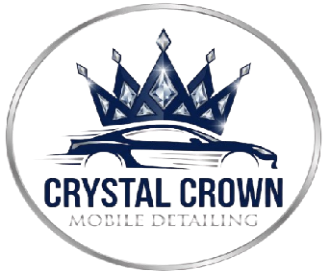

# Crystal Crown Mobile Detailing - Website Documentation



## 📋 Table of Contents

- [Overview](#overview)
- [Features](#features)
- [File Structure](#file-structure)
- [Installation & Setup](#installation--setup)
- [Page Documentation](#page-documentation)
- [Customization Guide](#customization-guide)
- [Responsive Design](#responsive-design)
- [JavaScript Functionality](#javascript-functionality)
- [Browser Support](#browser-support)
- [Performance Optimization](#performance-optimization)
- [Deployment](#deployment)
- [Troubleshooting](#troubleshooting)
- [Future Enhancements](#future-enhancements)

---

## 🎯 Overview

Crystal Crown Mobile Detailing is a premium, fully responsive website for a mobile car detailing business. The site features a modern dark blue theme with gold accents, creating a luxurious and professional appearance.

**Design Philosophy:**
- Premium aesthetic with luxury branding
- Mobile-first responsive design
- Fast loading and optimized performance
- User-friendly navigation and booking flow
- Comprehensive customer dashboard

**Technology Stack:**
- PHP (Templated pages with shared header/footer)
- HTML5 (Semantic markup)
- CSS3 (External stylesheet with CSS variables)
- Vanilla JavaScript (No dependencies)
- Google Fonts (Cinzel & Montserrat)

---

## ✨ Features

### Core Features
- ✅ **7 Complete Pages** - Home, Bookings, Contact, Login, Register, Dashboard, Profile
- ✅ **Multi-step Booking Form** - 4-step booking process with validation
- ✅ **User Authentication** - Login and registration with social options
- ✅ **Customer Dashboard** - Appointment management and service history
- ✅ **Profile Management** - User settings, vehicles, addresses, preferences
- ✅ **Responsive Design** - Mobile, tablet, and desktop optimized
- ✅ **Dark Theme** - Elegant navy blue with gold accents
- ✅ **Smooth Animations** - CSS transitions and scroll effects
- ✅ **Form Validation** - Client-side validation with error handling
- ✅ **Interactive UI** - Password toggles, accordions, tabs, toggles

### Design Features
- Custom color scheme with CSS variables
- Premium typography (Cinzel + Montserrat)
- Glass-morphism card effects
- Gradient backgrounds and overlays
- SVG icons throughout
- Hover effects and micro-interactions
- Sticky navigation with scroll effects

---

## 📁 File Structure

```
crystal-crown-detailing/
│
├── header.php                 # Shared partial: DOCTYPE, <head>, navbar
├── footer.php                 # Shared partial: footer, <script>, closing tags
│
├── index.php                  # Homepage with hero section
├── bookings.php               # Multi-step booking form
├── contact.php                # Contact form and FAQ
├── login.php                  # User login page
├── register.php               # User registration page
├── customerdashboard.php      # Customer dashboard
├── profile.php                # User profile management
│
├── styles.css                 # Main stylesheet (all pages)
├── script.js                  # JavaScript functionality
│
├── logo.webp                 # Logo image
├── hero-video.mp4            # Hero section video (to be added)
│
└── README.md                  # This documentation file
```

---

## 🚀 Installation & Setup

### Quick Start (5 minutes)

1. **Download all files** to a single folder
2. **Add your video** - Replace `hero-video.mp4` with your own video file
3. **Serve with PHP** - Use Apache with mod_php, or run `php -S localhost:8000`
4. **Open `index.php`** in a web browser
5. **Done!** The website is ready to use

### Video Setup
The homepage expects a video file named `hero-video.mp4` in the root directory.

**Video Specifications:**
- Format: MP4 (H.264 codec recommended)
- Resolution: 1920x1080 (Full HD) or higher
- Duration: 10-30 seconds (looping)
- File size: < 10MB for optimal loading
- Content: Car detailing process, before/after shots, or brand imagery

---

## 📄 Page Documentation

### 1. index.php - Homepage

**Sections:**
- Navigation - Fixed header with logo and menu
- Hero Section - Full-screen video background with CTA buttons
- Features - 3 key benefits
- Services - 6 service cards with pricing
- Testimonials - Customer reviews
- CTA Section - Call-to-action for bookings
- Footer - Links and contact information

### 2. bookings.php - Booking Form

**4-Step Process:**
1. Service Selection - Choose from 6 services
2. Vehicle Information - Make, model, year, condition
3. Schedule & Location - Date, time, address
4. Contact Information - Name, email, phone

### 3. contact.php - Contact Page

- Contact information cards
- Contact form with inquiry types
- FAQ accordion (6 questions)

### 4. login.php - Authentication

- Email and password login
- Remember me checkbox
- Forgot password link
- Social login (Google, Facebook)
- Link to registration

### 5. register.php - Registration

- Multi-field registration form
- Real-time password strength indicator
- Password confirmation
- Terms acceptance
- Social signup options

### 6. customerdashboard.php - Dashboard

**Dashboard Components:**
- 4 Statistics cards (bookings, services, status, points)
- Upcoming appointments with actions
- My vehicles widget
- Loyalty rewards card
- Quick actions menu
- Service history

### 7. profile.php - Profile Management

**5 Tabs:**
1. Personal Information - Edit profile details
2. Security - Change password, 2FA settings
3. My Vehicles - Manage registered cars
4. Saved Addresses - Home/work locations
5. Preferences - Notifications, defaults

---

## 🎨 Customization Guide

### Color Scheme

All colors are managed via CSS variables in `styles.css`:

```css
:root {
    --primary-navy: #0a1929;
    --secondary-navy: #132f4c;
    --accent-blue: #3b82f6;
    --accent-gold: #d4af37;
    --text-white: #ffffff;
    --text-gray: #cbd5e1;
}
```

### Typography

**Change Fonts:**
1. Choose fonts from [Google Fonts](https://fonts.google.com)
2. Update import in `header.php`
3. Update CSS variables in `styles.css`

### Business Information

**Update in `header.php` and `footer.php`:**
- Email: `info@crystalcrown.com`
- Phone: `+1 (555) 123-4567`
- Hours: `8 AM - 8 PM`
- Service prices
- Service descriptions

### Logo Replacement

Replace `logo.webp` or update all references:
```html

```

---

## 📱 Responsive Design

### Breakpoints

```css
/* Desktop - default (1025px+) */
/* Tablet - 1024px and below */
/* Mobile Large - 768px and below */
/* Mobile Small - 480px and below */
```

### Mobile Menu

- Desktop: Horizontal navigation
- Mobile: Hamburger menu slides from right
- Automatic close on link click

### Testing

**Recommended Test Devices:**
- iPhone SE (375px)
- iPhone 12 Pro (390px)
- iPad (768px)
- Desktop (1920px)

---

## ⚙️ JavaScript Functionality

### Core Features

1. **Navigation Scroll Effect** - Navbar changes on scroll
2. **Mobile Menu Toggle** - Hamburger menu functionality
3. **Multi-Step Form** - Step navigation with validation
4. **Form Validation** - Required field checking
5. **Password Strength** - Real-time strength calculation
6. **FAQ Accordion** - Toggle answers
7. **Profile Tabs** - Switch between profile sections
8. **Toggle Switches** - Preference toggles
9. **Password Visibility** - Show/hide passwords
10. **Appointment Actions** - Cancel/reschedule

---

## 🌐 Browser Support

| Browser | Version | Status |
|---------|---------|--------|
| Chrome | 90+ | ✅ Full Support |
| Firefox | 88+ | ✅ Full Support |
| Safari | 14+ | ✅ Full Support |
| Edge | 90+ | ✅ Full Support |
| Mobile Safari | iOS 14+ | ✅ Full Support |
| Chrome Mobile | Android 90+ | ✅ Full Support |

---

## ⚡ Performance Optimization

### Current Features
- External CSS (single file, cached)
- Minimal JavaScript (no libraries)
- Lazy loading images
- CSS-only animations

### Recommended Optimizations

1. **Compress Video** - Target < 5MB
2. **Optimize Images** - Use TinyPNG, ImageOptim
3. **Minify CSS/JS** - Reduce file sizes
4. **Enable Caching** - Browser caching headers
5. **Use CDN** - For fonts and assets

---

## 🚀 Deployment

### Option 1: PHP Hosting (Recommended)

1. Purchase hosting with PHP support (Bluehost, SiteGround, etc.)
2. Upload via FTP to `public_html`
3. Configure domain

### Option 2: Local Development

```bash
php -S localhost:8000
# Access at: http://localhost:8000
```

**Note:** Since the site uses PHP, static hosting (GitHub Pages, Netlify) is not supported. A PHP-capable server is required.

### Pre-Deployment Checklist

- [ ] Replace placeholder video
- [ ] Update business information
- [ ] Test all forms
- [ ] Verify responsive design
- [ ] Check all links
- [ ] Optimize images/video
- [ ] Test multiple browsers
- [ ] Add favicon
- [ ] Configure meta tags
- [ ] Set up analytics

---

## 🔧 Troubleshooting

### Video Not Playing

**Solutions:**
- Verify file path is correct
- Check video format (MP4 H.264)
- Ensure file is in correct folder
- Try different codec
- Check browser console

### Forms Not Submitting

**Solutions:**
- Verify JavaScript is loaded
- Check browser console
- Ensure form IDs match JS selectors
- Add backend for actual submission

### Mobile Menu Not Working

**Solutions:**
- Check JavaScript loaded
- Verify class names match
- Test click event
- Clear browser cache

### Styling Issues

**Solutions:**
- Verify CSS link in `header.php`
- Clear browser cache (Ctrl+Shift+R)
- Check for CSS syntax errors
- Use DevTools inspector

---

## 🎯 Future Enhancements

### Recommended Additions

1. **Backend Integration**
   - Database for bookings
   - User authentication with sessions
   - Real API endpoints

2. **Payment Processing**
   - Stripe integration
   - Online booking payments
   - Secure checkout

3. **Email Notifications**
   - Booking confirmations
   - Appointment reminders
   - Thank you emails

4. **SMS Reminders**
   - Twilio integration
   - 24-hour reminders

5. **Review System**
   - Customer reviews
   - Star ratings
   - Photo uploads

6. **Booking Calendar**
   - Real-time availability
   - Technician scheduling
   - Time slot management

7. **Blog/Content**
   - Car care tips
   - Company news
   - SEO benefits

8. **Live Chat**
   - Real-time support
   - Tawk.to or Intercom

9. **Analytics Dashboard**
   - Booking trends
   - Revenue tracking
   - Popular services

10. **Mobile App (PWA)**
    - Progressive Web App
    - Native app experience
    - Offline functionality

### SEO Optimization

**Add Meta Tags:**
```html
<meta name="description" content="Premium mobile car detailing...">
<meta property="og:title" content="Crystal Crown Mobile Detailing">
<meta property="og:image" content="og-image.jpg">
```

**Structured Data:**
```json
{
  "@context": "https://schema.org",
  "@type": "LocalBusiness",
  "name": "Crystal Crown Mobile Detailing"
}
```

### Accessibility

**WCAG 2.1 Compliance:**
- Keyboard navigation
- ARIA labels
- Alt text for images
- Color contrast ratios
- Focus indicators

---

## 📝 License

**MIT License**

Permission is granted to use, modify, and distribute this software for personal or commercial use.

---

## 📞 Support

**Business Contact:**
- Email: info@crystalcrown.com
- Phone: +1 (555) 123-4567
- Hours: Monday - Sunday, 8 AM - 8 PM

**Technical Support:**
- Review this README
- Check troubleshooting section
- Test in multiple browsers
- Verify file paths

---

## 🎓 Learning Resources

**Web Development:**
- MDN Web Docs: [developer.mozilla.org](https://developer.mozilla.org)
- CSS-Tricks: [css-tricks.com](https://css-tricks.com)
- JavaScript.info: [javascript.info](https://javascript.info)

**Performance:**
- Google PageSpeed: [pagespeed.web.dev](https://pagespeed.web.dev)
- Web.dev: [web.dev](https://web.dev)

---

**Thank you for using Crystal Crown Mobile Detailing Website!**

Customize the content to match your business, add real testimonials, and integrate with a backend for full functionality.

**Good luck with your mobile detailing business! 🚗✨**